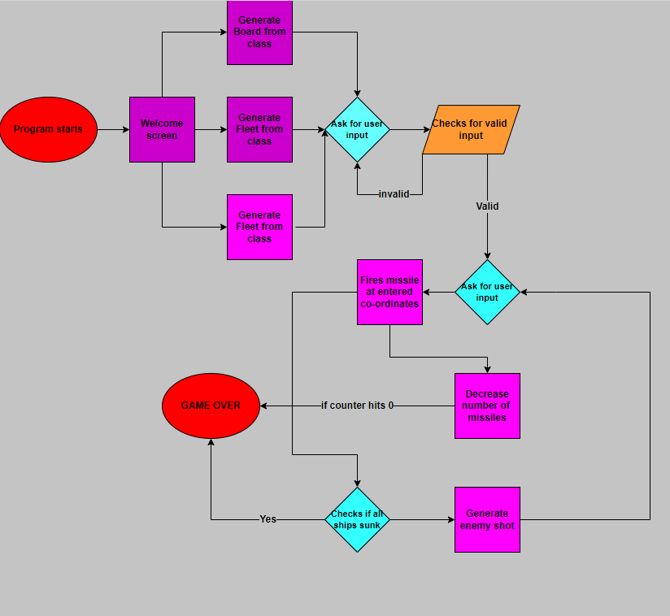
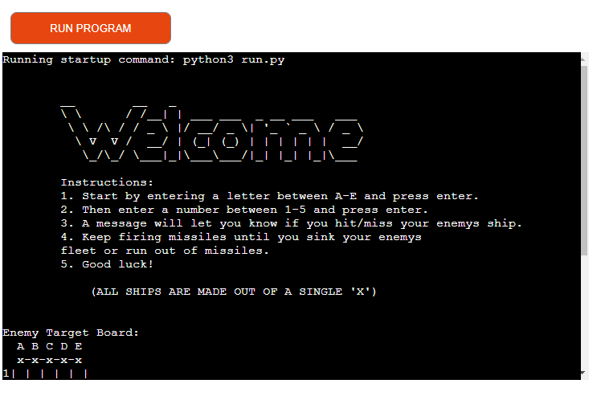
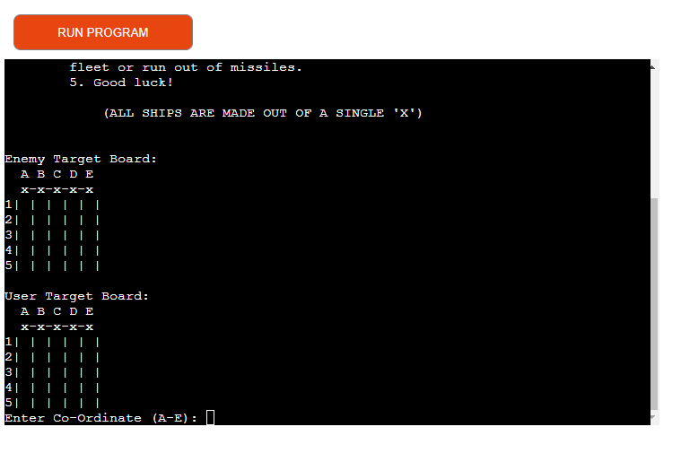
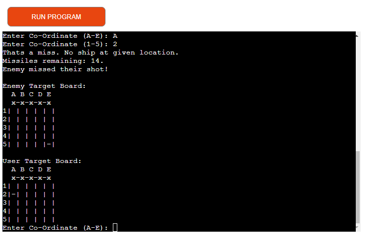
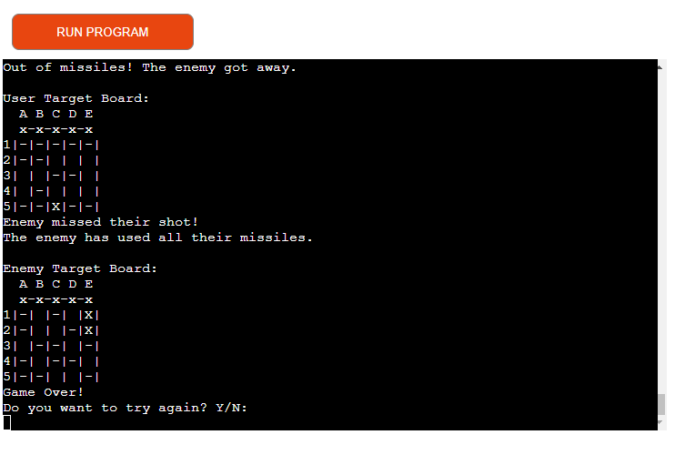
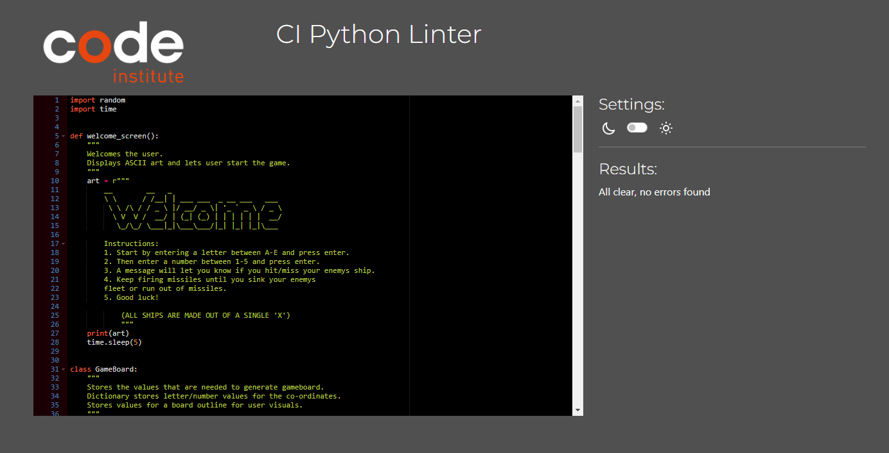

# The Battleship Game

The Battleships game involves strategic thinking, where participants aim to destroy the opposing fleet by making guesses about co-ordinates.
The version i made uses a board, created by python lists and incorporates a logic engine that lets the computer fire back at your every move.

## Project Goals
The goal of this project is to make a fun and logic game using python.

## User Goals
The application user want to play a logic game while having fun

### Site Owner Goals
The site owner goal is to provide a working and fun game which challange the user to push for the win while facing the computer.

## User Experience

### Target Audience
- The game is for all ages as long as you are in for a logic challange.
- Users who like to pass time or just want to try a new game.

### User Stories
- To have a great experience
- To be able to face of against the computer.
- To be given instructions along the way. For example when the game is won/lost.
- To be given the choice to play again or exit the game while finished.

### Game Instructions

### Main Screen
The main screen welcomes you to the game with some ASCII art and some instructions about the game. Feel free to make your first move as soon as you are ready.

### Gameboard
The board where the battle will be played out consists of two main components:

The Users board where your fleet will be positioned and displayed.
The Target board that tracks your fired missiles and hits on the enemy.

### Gameplay
The game is designed so that the user and the computer take turns firing missiles at each other.

The user first enters a letter between A-E and presses enter, then doing the same thing but with a number between 1-5. 

Those are the Co-Ordinates the user will fire at. If its a hit, the message 'Thats a hit! Enemy ship down!' appears. If its a miss then the 'Thats a miss. No ship at given location.' message appears.

You start the game with 15 missiles so be strategic when choosing Co-ordinates! If you run out of missiles, the message 'Out of missiles! The enemy got away.' appears.

You win the game by eliminating the enemys fleet. However if the enemy sinks all of your ships before that, you lose. 

When the Game Over message appears, you get asked if you want to play again. You answer with Y/N. If you press Y, the game restarts. If you press N you are relieved of duty.

## Technical Design

### Flowchart

## Libraries and technologies used

### Languages
- Python3

### Python Libraries:

- [Random](https://docs.python.org/3/library/random.html#module)
- [Time](https://docs.python.org/3/library/time.html#module-time)

### Programs Used:

- [GitHub](https://github.com/)
- [Diagrams](https://app.diagrams.net)
- [Code Institute Herokuapp](https://pep8ci.herokuapp.com/)
- [Heroku](https://dashboard.heroku.com/apps/)

## Features

### Welcome Message
- Welcomes the user with a message and some instructions.

### Gameboard
- Shows the gameboards generated for the user and computer.

### Game Inputs
- Lets the user input their guesses and then get feedback of the result.
- Displays the guess of the computer.

### Game Over
- When the game is over, for any of the possible reasons, it shows the user its possible options. Either to play again or exit.

## Testing

### PEP8 Testing
- The code has been run through [Code institute Herokuapp](https://pep8ci.herokuapp.com/#). No errors displayed.

## Deployment
The site was deployed using [Heroku](https://dashboard.heroku.com/apps). Live link to the site can be found here: [The Battleship Game](https://the-battle-ship-game-ae2b90313f52.herokuapp.com/)

Before deploying the project to Heroku, pip3 freeze > requirements.txt was used to add everything needed to the requirements.txt file. Otherwise the game wont run on Heroku.

Deployment steps:
1. Log in to [Heroku](https://dashboard.heroku.com/apps) or create an account if you dont have one.
2. On the main page of the site, find the button in the top right corner that says 'New', press it and then click on 'Create New App' from the dropdown menu.
3. Choose a name for your app. It should be meaningful and needs to be unique.
4. Select the region your in.
5. Click 'Create App'
6. Click the button that says 'Reveal Config Vars' and locate the field that says 'KEY', here you enter the word 'PORT'. And in the field that says value you enter the number '8000'.
7. Repeat the steps again but change the word 'PORT' to 'CREDS' and in this case enter your creds.json value.
8. Then you scroll down to the section that says 'Buildpacks'. Click Add Buildpack and select 'python', and click save.
9. Repeat the step above but instead of python you select node.js. Be sure the buildpacks are in the correct order, which has python as the first buildpack followed by node.js. Click save.
10. Now you are ready to deploy so you need to locate the deploy button to the left of the settings button at the top of the screen, and press it.
11. Select GitHub to deploy from.
12. If you haven't already, confirme you want to connect to GitHub.
13. Now you need to search for your repository and connect it.
14. Now you are ready to deploy. So scroll down to the bottom of the screen and choose either to deploy manually or choose the automatic deploy option. If you choose manually, you need to re-deploy everytime you change something. If you choose automatic deployment, your site updates by itself when changes happen.
15. Click the button that says 'view' to show your deployed site.
16. The site is live.

## Credits
### Resources Used
- [W3Schools](https://www.w3schools.com/)
- [Stack Overflow](https://stackoverflow.com/)
- [ASCII Art](https://www.asciiart.eu/text-to-ascii-art)
- [Diagrams App](https://app.diagrams.net)

## Ackknowledgements
The biggest thank you to my mentor Antonio Rodrigues for feedback and help along the way!

The project was inspired by the work of 'Knowledge Mavens' on YouTube, and also from another student, Noah Samawi. 
 